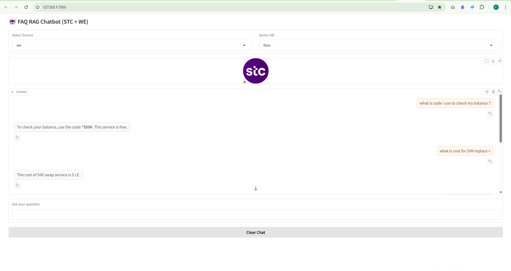

# 🤖  FAQ Customer Chatbot  

An AI-powered chatbot that answers telecom FAQs using Retrieval-Augmented Generation (RAG) based on real scraped data.

---

## 🚀 Features

- 🔍 Semantic search using FAISS & ChromaDB
- 🧠 LLM-powered answers using Claude (Anthropic)
- 📄 Context-aware responses using RAG
- 🌐 FAQ scraping using Firecrawl
- 🧹 Data cleaning using Regex
- 🎛️ Interactive UI using Gradio

---

## 🏗️ Architecture

User Query → Embedding → Vector Search → Context Retrieval → LLM → Answer

---

## 🧰 Tech Stack

| Component | Technology |
|----------|----------|
| Tool Used| Firecrawl https://www.firecrawl.dev/ to scraping FAQ|
| Cleaning | Regex |
| Framework | LangChain |
| Embedding | sentence-transformers/all-MiniLM-L6-v2 |
| Vector DB | FAISS + ChromaDB |
| LLM | Claude (Anthropic) |
| UI | Gradio |

---

## 📂 Project Structure
FAQ-RAG-Chatbot/
├── app_gradio.py
├── rag_pipeline_01.py
├── rag_pipeline_02.py
├── clean_faq.py
├── firecrawl_scraper.py
├── data/
├── Data_cleaned/
├── vectorstores/
├── assets/
├── requirements.txt

---

## ⚙️ Setup

### 1️⃣ Clone repo

git clone https://github.com/Fathi-Farouk/FAQ_RAG_ChatBot.git  
cd FAQ_RAG_ChatBot

### 2️⃣ Create virtual environment
python -m venv venv
venv\Scripts\activate

### 3️⃣ Install dependencies
pip install -r requirements.txt

### 4️⃣ Add API key
Create .env file

#### LLM API
Anthropic_Claude_API=

####  Firecrawl API
FIRECRAWL_API_KEY=

####  FAQ URLs
***FAQ_URL_STC="https://www.stc.com.sa/en/personal/support/faqs/quick-solutions.html"***
***FAQ_URL_WE="https://www.te.eg/wps/portal/te/Personal/Help%20And%20Support%20l/FAQ/?1dmy&urile=wcm%3Apath%3A%2FTE%2FHelp%2FFAQ%2F"***

####  HuggingFace embedding API
HF_TOKEN=

## ▶️ Run App
python app_gradio.py

---
## 📸 Demo

### 🎯 What this app does
- Select telecom provider (STC / WE)
- Choose vector database (FAISS / Chroma)
- Ask any FAQ question
- Get AI-generated answer grounded in real data

